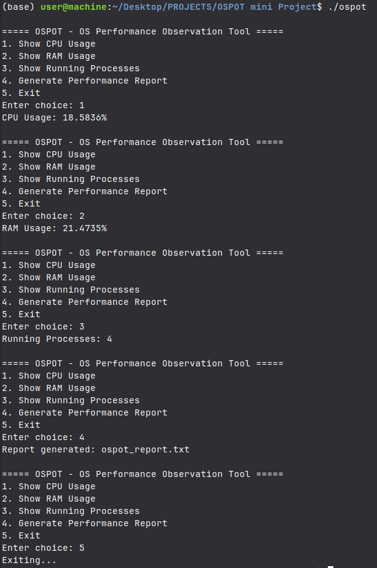

# OSPOT (OS Performance Observation Tool)

**OSPOT** is a lightweight, low-level Linux system performance monitoring utility written in C++.  
It directly interfaces with the Linux virtual filesystem to extract real-time telemetry regarding CPU usage, memory allocation, and overall system state.

---

## 🧬 System Architecture

OSPOT bypasses high-level monitoring libraries and reads raw telemetry directly from kernel-exposed virtual filesystem interfaces.

```text
          [ OSPOT Core Engine ]
                    |
        +-----------+-----------+
        |                       |
   [ /proc/stat ]        [ /proc/meminfo ]
    (CPU Metrics)          (Memory Metrics)
        |                       |
        +-----------+-----------+
                    |
         [ Telemetry Aggregator ]
                    |
           [ ospot_report.txt ]
```

---

## ✨ Features

- Real-time CPU utilization monitoring
- Memory usage tracking
- Lightweight CLI interface
- Linux virtual filesystem integration
- Telemetry report generation
- Minimal dependencies
- Written fully in raw C++

---

## 🚀 Quick Start

### 📦 Compilation

OSPOT requires **g++ (GCC)** to compile.

Run the following command inside the project directory:

```bash
g++ ospot.cpp -o ospot
```

---

### ▶️ Execution

After successful compilation, run:

```bash
./ospot
```

The interactive command-line interface will start immediately.

> Selecting option `4` from the menu generates a local telemetry report file named:
>
> ```text
> ospot_report.txt
> ```

---

## 📸 Interactive Demo

Example of the CLI monitoring interface during execution:



---

## 📁 Project Structure

```text
OSPOT/
│
├── ospot.cpp
├── README.md
├── demo_screenshot_ospot.png
└── ospot_report.txt
```

---

## 🛠️ Technologies Used

- C++
- Linux `/proc` Virtual Filesystem
- GCC / g++
- Command-Line Interface (CLI)

---

## 🧠 Learning Objectives

This project demonstrates:

- Linux system-level programming
- Parsing kernel telemetry interfaces
- File handling in C++
- CLI application development
- Real-time performance monitoring concepts

---

## 🔮 Future Improvements

- Disk I/O monitoring
- Network telemetry support
- Multi-threaded sampling
- Export reports in JSON/CSV
- ncurses-based live dashboard
- Historical telemetry visualization

---

## 📜 License

This project is open-source and available under the MIT License.
